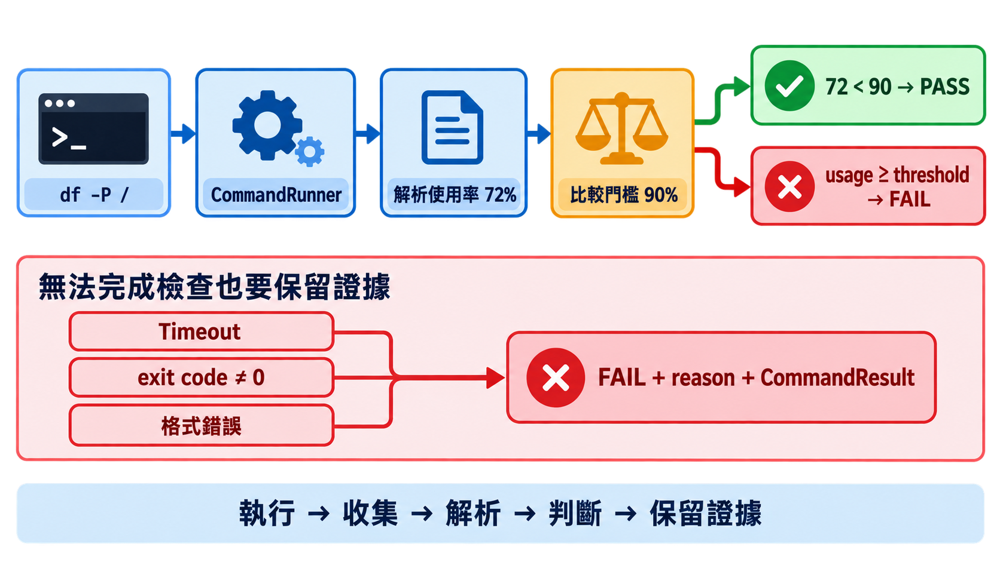
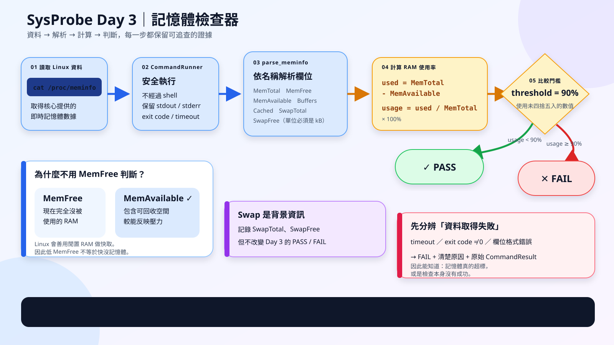
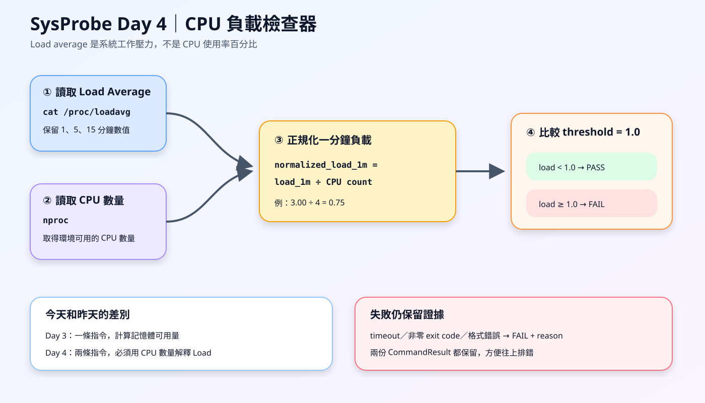
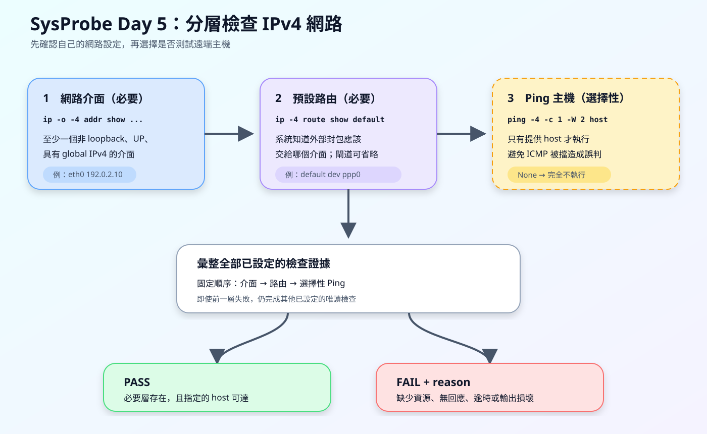
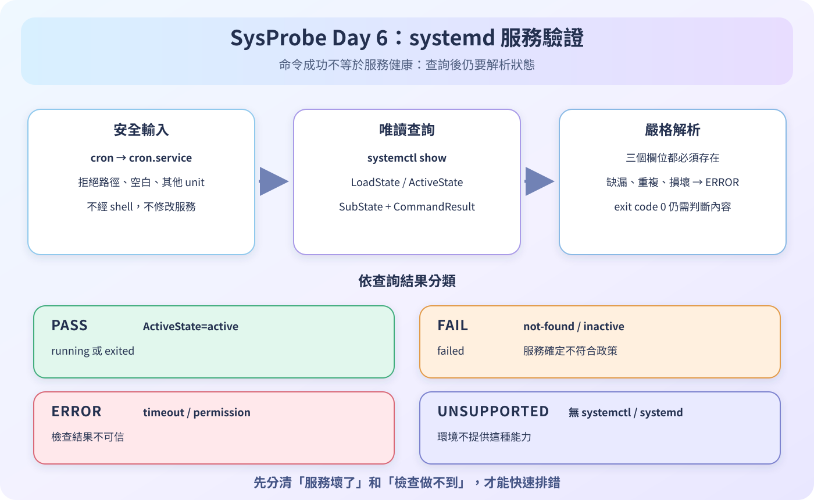

# SysProbe

SysProbe is a learning-focused Linux validation framework. Day 1 builds the
local command-execution boundary. Day 2 adds the first policy layer: a root
filesystem disk validator with an explicit PASS/FAIL threshold. Day 3 adds a
memory validator based on Linux available-memory semantics. Day 4 adds a CPU
validator that normalizes Linux load average by available CPU count. Day 5
adds a layered IPv4 network validator with an optional reachability check. Day 6
adds a read-only systemd service validator with explicit PASS, FAIL, ERROR, and
UNSUPPORTED outcomes.

## Day 1 behavior

`run_command`:

- accepts an argument vector instead of a shell command string;
- captures stdout, stderr, exit code, and elapsed time;
- returns nonzero exit codes as structured evidence;
- turns a timeout into a structured result with `timed_out=True`.

The runner records what happened. Future validators decide whether those facts
mean PASS or FAIL.

## Day 2 behavior

`validate_disk` runs `df -P /` on Linux, extracts the root-filesystem usage
percentage, and compares it with a configurable threshold. The default is 90%.

```python
from sysprobe.validators.disk import validate_disk

result = validate_disk()

print("PASS" if result.passed else "FAIL")
print(result.reason)
```

The returned result keeps the original `CommandResult`, so failures retain
stdout, stderr, exit code, duration, and timeout evidence. Running the real
validator requires Linux, while its deterministic unit tests run on Windows.

Run only the Day 2 tests:

```powershell
$env:PYTEST_DISABLE_PLUGIN_AUTOLOAD='1'
python -m pytest tests/test_disk.py -v
```

### Day 2 visual summary



## Day 3 behavior

`validate_memory` runs `cat /proc/meminfo` on Linux and calculates RAM usage
from `MemTotal - MemAvailable`. The default failure threshold is 90%.

```python
from sysprobe.validators.memory import validate_memory

result = validate_memory()

print("PASS" if result.passed else "FAIL")
print(result.reason)
```

Linux may use otherwise idle RAM for reclaimable caches, so low `MemFree` does
not by itself mean memory pressure. SysProbe uses `MemAvailable` for its
decision. Swap totals are recorded for context but do not affect Day 3 status.

Running the real validator requires Linux. Its deterministic tests run on
Windows with representative `/proc/meminfo` samples.

Run only the Day 3 tests:

```powershell
$env:PYTEST_DISABLE_PLUGIN_AUTOLOAD='1'
python -m pytest tests/test_memory.py -v
```

### Day 3 visual summary



## Day 4 behavior

`validate_cpu` runs `cat /proc/loadavg` and `nproc` on Linux. It divides the
one-minute load average by the available CPU count, then compares that
normalized value with a configurable threshold. The default is `1.0`.

```python
from sysprobe.validators.cpu import validate_cpu

result = validate_cpu()

print("PASS" if result.passed else "FAIL")
print(result.reason)
```

Load average is not CPU utilization percentage. It includes runnable work and
tasks waiting in uninterruptible sleep. The 5- and 15-minute values are kept
for context, but only the 1-minute value decides Day 4 status.

Unlike the Day 3 memory check, Day 4 needs two Linux commands. The result keeps
both `CommandResult` records so command, timeout, exit-code, stdout, and stderr
evidence remain available for debugging.

The real commands require Linux. Deterministic tests run on Windows with
representative `/proc/loadavg` and `nproc` output.

Run only the Day 4 tests:

```powershell
$env:PYTEST_DISABLE_PLUGIN_AUTOLOAD='1'
python -m pytest tests/test_cpu.py -v
```

### Day 4 visual summary



## Day 5 behavior

`validate_network` checks three IPv4 layers on Linux:

1. `ip -o -4 addr show scope global up` finds active, non-loopback interfaces
   with a global IPv4 address.
2. `ip -4 route show default` finds the route used for destinations outside the
   local networks.
3. `ping -4 -c 1 -W 2 <host>` runs only when the caller supplies `host`.

```python
from sysprobe.validators.network import validate_network

local_result = validate_network()
remote_result = validate_network(host="example.com")

print("PASS" if local_result.passed else "FAIL")
print(local_result.reason)
print("PASS" if remote_result.passed else "FAIL")
print(remote_result.reason)
```

Ping is optional because some healthy networks block ICMP replies. Without a
host, PASS requires an active global IPv4 interface and a default IPv4 route.
With a host, PASS additionally requires one successful ping reply.

The result retains the interface, route, and optional ping `CommandResult`
objects. A ping exit code of `1` means the host did not reply; timeouts and
other nonzero exit codes are reported as execution failures. Host input is
validated before commands run, and argument vectors avoid shell injection.

The real commands require Linux. Deterministic unit tests run on Windows using
representative command output and never contact the network.

Run only the Day 5 tests:

```powershell
$env:PYTEST_DISABLE_PLUGIN_AUTOLOAD='1'
python -m pytest tests/test_network.py -v
```

### Day 5 visual summary



## Day 6 behavior

`validate_service` queries one local systemd service with a read-only
`systemctl show` command:

```text
systemctl show <name>.service --property=LoadState --property=ActiveState --property=SubState --no-pager
```

The caller may provide either `cron` or `cron.service`. The service name is
validated before execution, and the command runs without a shell. The validator
strictly parses the returned properties; a successful command alone does not
prove that the service is healthy.

```python
from sysprobe.validators.service import validate_service

result = validate_service("cron")

print(result.status.value.upper())
print(result.reason)
print(result.metrics)
```

Service outcomes are:

- `PASS`: the service is active.
- `FAIL`: the service is absent, inactive, or failed.
- `ERROR`: the check timed out, lacked permission, encountered an unexpected
  execution problem, or received malformed output.
- `UNSUPPORTED`: `systemctl` or a usable systemd environment is unavailable.

The shared `ValidationStatus` enum gives these outcomes stable machine values
for future CLI and JSON interfaces. Once `LoadState=not-found` is excluded,
`LoadState=loaded` with `ActiveState=active` is `PASS` even when
`SubState=exited`, which supports successful oneshot services.

Running the real check requires Linux with systemd. Deterministic Windows unit
tests use controlled command results and never start, stop, or modify services.

Run only the Day 6 tests:

```powershell
$env:PYTEST_DISABLE_PLUGIN_AUTOLOAD='1'
python -m pytest tests/test_service.py tests/test_result.py tests/test_command_runner.py -v
```

### Day 6 visual summary



## Requirements

- Python 3.10 or newer

## Setup

```powershell
python -m venv .venv
.venv\Scripts\Activate.ps1
python -m pip install -r requirements.txt
```

On Linux or WSL, activate the environment with:

```bash
source .venv/bin/activate
```

## Run the tests

```powershell
python -m pytest -v
```

If unrelated globally installed pytest plugins interfere with collection, run:

```powershell
$env:PYTEST_DISABLE_PLUGIN_AUTOLOAD='1'
python -m pytest -v
```

## Usage

```python
from sysprobe.command_runner import run_command

result = run_command(["free", "-m"], timeout_seconds=5.0)

print(result.exit_code)
print(result.stdout)
print(result.stderr)
print(result.timed_out)
```

The argument-vector API and `shell=False` avoid shell injection and keep
argument boundaries explicit. Shell pipelines, SSH, retries, validators, and
command-launch error classification are intentionally outside the Day 1 scope.
